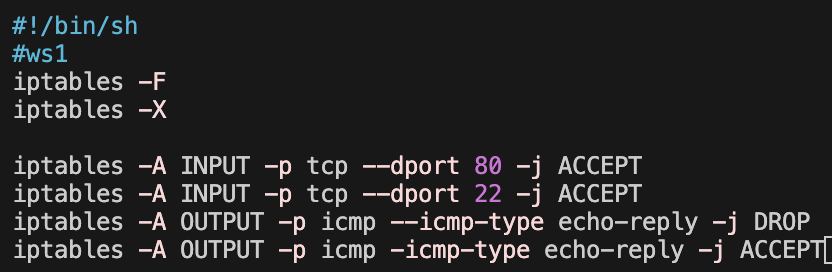
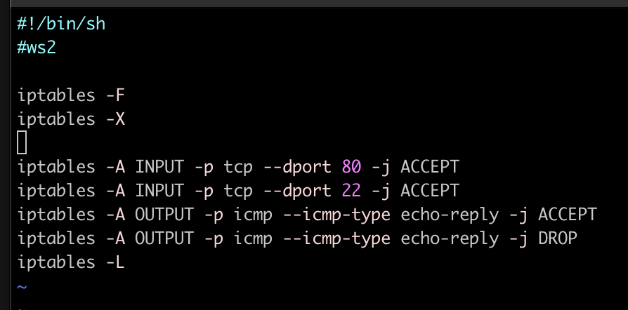
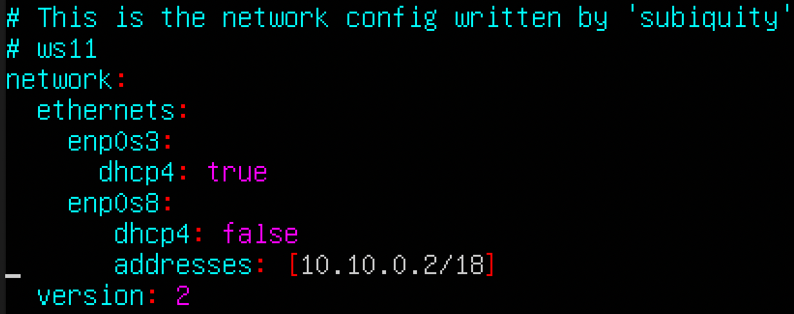
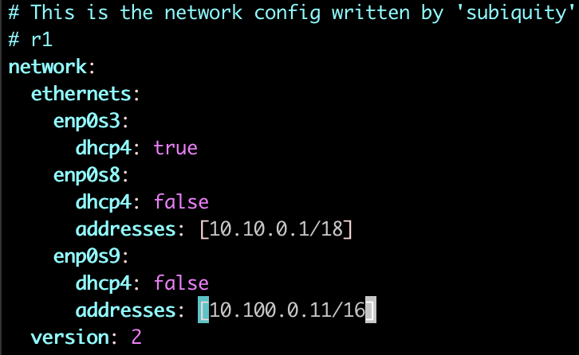
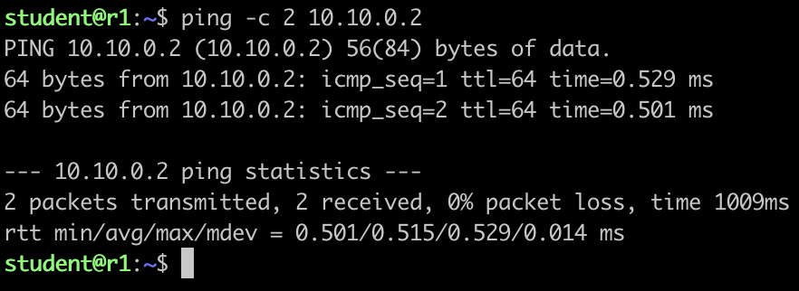
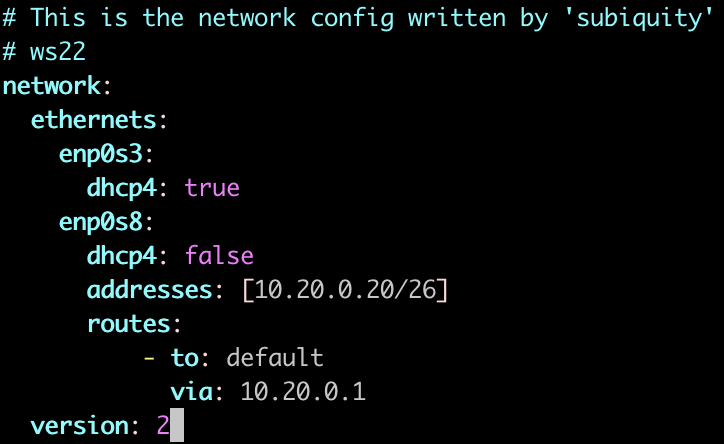
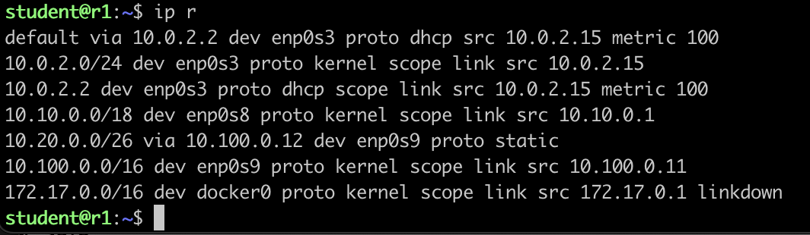
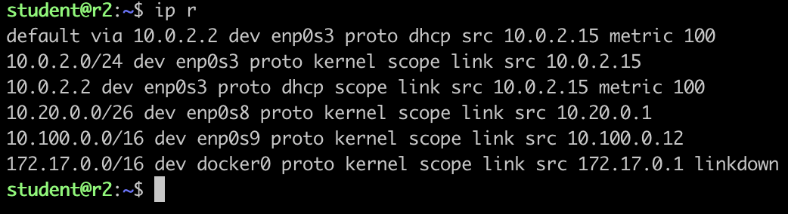

## Contents

1. [Part 1. Инструмент ipcalc](#part-1-инструмент-ipcalc)
2. [Part 2. Статическая маршрутизация между двумя машинами](#part-2-статическая-маршрутизация-между-двумя-машинами)
3. [Part 3. Утилита `iperf3`](#part-3-утилита-iperf3)
4. [Part 4. Сетевой экран](#part-4-сетевой-экран)
5. [Part 5. Статическая маршрутизация сети](#part-5-статическая-маршрутизация-сети)
6. [Part 6. Динамическая настройка IP](#part-6-динамическая-настройка-ip)
7. [Part 7. NAT](#part-7-nat)
8. [Part 8. Знакомство с SSH Tunnels](#part-8-знакомство-с-ssh-tunnels)

## Part 1. Инструмент ipcalc

### 1.1. Сети и маски
Инструмент ` ipcalc ` можно применять для следующих задач:
- проверить IP-адрес;
- показать рассчитанный широковещательный адрес;
- отображение имени хоста, определенного через DNS;
- отображение сетевого адреса или префикса.

Установка ipcalc:
```
sudo apt install ipcalc
```


Screenshot 1. Network

Меняем название машины:
```
sudo hostnamectl set-hostname ws1
```
Делаем перезагрузку системы:
```
sudo reboot
```
### Определить и записать в отчёт:

1. Адрес сети 192.167.38.54/13:
```
192.160.0.0
```
2. Перевод маски 255.255.255.0:
```
префиксная запись: /24
двоичная запись: 11111111.11111111.11111111. 00000000
```
3. Перевод /15:
```
обычная запись: 255.254.0.0

двоичая запись: 1111111111.11111110.00000000.00000000
```
4. Перевод маски 1111111111.11111111.11111111.11110000:
```
обычная запись: 255.255.255.240
префиксная запись: /28
```

5. Минимальный и максимальный хост в сети 12.167.38.4 при масках: /8, 11111111.11111111.00000000.00000000, 255.255.254.0 и /4
* * *
маска /8:

- `минимальный хост: 12.0.0.1`

- `максимальный хост: 12.255.255.254`
* * *
маска /1111111.11111111.00000000.00000000:

- `минимальный хост: 12.167.0.1`

- `максимальный хост: 12.167.255.254`
* * *
маска /255.255.254.0:

- `минимальный хост: 12.167.38.1`

- `максимальный хост: 12.167.39.254`
* * *
маска /4:

- `минимальный хост: 0.0.0.1`

- `максимальный хост: 15.255.255.254`
* * *

### 1.2. Localhost
#### Определить и записать в отчёт, можно ли обратиться к приложению, работающему на localhost, со следующими IP: 194.34.23.100, 127.0.0.2, 127.1.0.1, 128.0.0.1.
Данные IP можно пропинговать, чтобы узнать их доступность с помощью команды: `ping -c 2 194.34.23.100/16`

`есть доступ: 127.0.0.2/24, 127.1.0.1`

`нет доступа: 194.34.23.100, 128.0.0.1`

### 1.3. Диапазоны и сегменты сетей
#### Определить и записать в отчёт:
* * *
какие из перечисленных IP можно использовать в качестве публичного, а какие только в качестве частных:

`10.0.0.45         - Privat`

`134.43.0.2        - Public`

`192.168.4.2       - Privat`

`172.20.250.4      - Privat`

`172.0.2.1         - Public`

`192.172.0.1       - Public`

`172.68.0.2        - Public`

`172.16.255.255    - Privat`

`10.10.10.10       - Privat`

`192.169.168.1     - Public`
* * *
какие из перечисленных IP адресов шлюза возможны у сети 10.10.0.0/18;

- `10.10.0.2`

- `10.10.10.10`

- `10.10.1.255`
* * *

## Part 2. Статическая маршрутизация между двумя машинами
Поднять две виртуальные машины (далее -- ws1 и ws2).
Меняем название машины:
```
sudo hostnamectl set-hostname ws1
```
Делаем перезагрузку системы:
```
sudo reboot
```
Удобная работа через терминал для ws2:
```
ssh student@localhost -p 2222
```
* * *
#### С помощью команды `ip a` посмотреть существующие сетевые интерфейсы


Screenshot 2. Сетевые интерфейсы ws1


Screenshot 3. Сетевые интерфейсы ws2
* * *
#### Описать сетевой интерфейс, соответствующий внутренней сети, на обеих машинах и задать следующие адреса и маски: ws1 - 192.168.100.10, маска /16, ws2 - 172.24.116.8, маска /12
```
sudo vim /etc/netplan/00-installer-config.yaml
```


Screenshot 4. Сетевой интерфейс ws1


Screenshot 5. Сетевой интерфейс ws2
* * *
#### Выполнить команду `netplan apply` для перезапуска сервиса сети


Screenshot 6. Выполнение команды, ws1


Screenshot 7. Выполнение команды, ws2
* * *
### 2.1. Добавление статического маршрута вручную
#### Добавить статический маршрут от одной машины до другой и обратно при помощи команды вида `ip r add`
Вывод текущей таблицы маршрутизации в Linux:
```
ip route
```
Таблица маршрутизации ядра:
```
netstat -n -r
```
Редактируем файл `00-intsaller-config.yaml`: 
```
sudo vim /etc/netplan/00-intsaller-config.yaml
{
dhcp: false 
adress: [ip]
}
```
Добавить статический маршрут:
```
sudo ip route add 172.24.116.8 via 192.168.100.10 dev enp0s8
sudo ip r add 192.168.100.10 via 172.24.116.8 dev enp0s8
```
Посмотреть записи о маршрутах в локальной таблице IP-маршрутизации:
```
route -n
```


Screenshot 8. Таблица IP-маршрутизации ws1 


Screenshot 9. Таблица IP-маршрутизации ws2

#### Пропинговать соединение между машинами
Для пинга машин в VirtualBox во вкладке `Network`  включить `Internal Network`.
```
ping -c 3 192.168.100.10
```


Screenshot 10. Пинг ws1 


Screenshot 11. Пинг ws2
### 2.2. Добавление статического маршрута с сохранением
#### Перезапустить машины: `sudo reboot`
#### Добавить статический маршрут от одной машины до другой с помощью файла etc/netplan/00-installer-config.yaml


Screenshot 12. Именённый файл `00-intsaller-config.yaml` в ws1


Screenshot 13. Именённый файл `00-intsaller-config.yaml` в ws2

#### Пропинговать соединение между машинами


Screenshot 10. Пинг ws1


Screenshot 11. Пинг ws2

## Part 3. Утилита `iperf3`

### 3.1. Скорость соединения
```
8 Mbps = 1 MB/s

100 MB/s = 800000 Kbps

1 Gbps = 1000 Mbps
```
### 3.2. Утилита iperf3
```
sudo apt update
sudo apt install iperf3
```
Для запуска на машине ws1:
```
iperf3 -s
```
Для запуска на машине ws2:
```
iperf3 -c 192.168.100.10
```
Скорость соединения: 3.97 Gbits/sec


Screenshot 14. Скорость соединения на машине ws1


Screenshot 15. Скорость соединения на машине ws2

## Part 4. Сетевой экран

### 4.1. Утилита iptables
##### Создать файл */etc/firewall.sh*, имитирующий фаерволл, на ws1 и ws2:
##### Нужно добавить в файл подряд следующие правила:
##### 1) на ws1 применить стратегию когда в начале пишется запрещающее правило, а в конце пишется разрешающее правило (это касается пунктов 4 и 5)
##### 2) на ws2 применить стратегию когда в начале пишется разрешающее правило, а в конце пишется запрещающее правило (это касается пунктов 4 и 5)
##### 3) открыть на машинах доступ для порта 22 (ssh) и порта 80 (http)
##### 4) запретить *echo reply* (машина не должна "пинговаться”, т.е. должна быть блокировка на OUTPUT)
##### 5) разрешить *echo reply* (машина должна "пинговаться")
```
sudo vim /etc/firewall.sh
```


Screenshot 16. Правила ws1



Screenshot 17. Правила ws1

#### Запустить файлы на обеих машинах командами `chmod +x /etc/firewall.sh` и `/etc/firewall.sh`
```
sudo chmod +x /etc/firewall.sh
sudo /etc/firewall.sh
```


Screenshot 18. Запуск на ws1


Screenshot 19. Запуск на ws2

* * *

`Разница между стратегиями: ws1 может отправить пакеты к ws2, а ws2 не может отправить пакеты ws1 тк мы указали правило на запрет входящих пакетов`

* * *
### 4.2. Утилита nmap
#### Командой **ping** найти машину, которая не "пингуется", после чего утилитой **nmap** показать, что хост машины запущен
```
sudo apt  install nmap # version 7.80+dfsg1-2build1

ping -c 3 172.24.116.8

ping -c 3 192.168.100.10

nmap 192.168.100.10
```


Screenshot 20. Пинг на ws1


Screenshot 21. Пинг + статус хоста на ws2

#### Сохранить дампы образов виртуальных машин


Screenshot 22. Дамп образов виртуальной машины ws1


Screenshot 23. Дамп образов виртуальной машины ws2

## Part 5. Статическая маршрутизация сети


### 5.1. Настройка адресов машин 

```
ssh student@localhost -p 2225
sudo hostnamectl set-hostname ws1
sudo reboot
sudo vim /etc/netplan/00-installer-config.yaml
sudo netplan apply
```



Screenshot 24. Настройка адреса для ws11


Screenshot 25. Настройка адреса для ws22


Screenshot 26. Настройка адреса для ws21




Screenshot 27. Настройка адреса для r1


Screenshot 28. Настройка адреса для r2

#### Перезапустить сервис сети. Если ошибок нет, то командой `ip -4 a` проверить, что адрес машины задан верно. Также пропинговать ws22 с ws21. Аналогично пропинговать r1 с ws11.


Screenshot 29. `ip -4 a` для r1


Screenshot 30. Пинг ws22 с машины ws21



Screenshot 31. Пинг r1 с машины ws11

### 5.2. Включение переадресации IP-адресов
Для включения переадресации IP, выполните команду на роутерах:
```
sysctl -w net.ipv4.ip_forward=1
```
При таком подходе переадресация не будет работать после перезагрузки системы.


Screenshot 32. Вызов команды `sysctl` на r1


Screenshot 33. Вызов команды `sysctl` на r2

Откройте файл `/etc/sysctl.conf` и добавьте в него следующую строку:
`net.ipv4.ip_forward = 1`
При использовании этого подхода, IP-переадресация включена на постоянной основе.


Screenshot 34. Скриншт измененного файла

### 5.3. Установка маршрута по-умолчанию
Настроить маршрут по-умолчанию (шлюз) для рабочих станций. Для этого добавить `default` перед IP роутера в файле конфигураций



Screenshot 35. default перед IP ws22


Screenshot 36. default перед IP ws21


Screenshot 37. default перед IP ws11

Вызвать `ip r` и показать, что добавился маршрут в таблицу маршрутизации


Screenshot 38. `ip r` ws11, ws22, ws21

Пропинговать с ws11 роутер r2 и показать на r2, что пинг доходит. Для этого использовать команду:
```
tcpdump -tn -i eth1
```


Screenshot 39. `tcpdump -tn -i eth1`

### 5.4. Добавление статических маршрутов
Добавить в роутеры r1 и r2 статические маршруты в файле конфигураций. Пример для r1 маршрута в сетку 10.20.0.0/26:
```
# Добавить в конец описания сетевого интерфейса eth1:
- to: 10.20.0.0
  via: 10.100.0.12
```


Screenshot 40. r1


Screenshot 41. r2

Вызвать `ip r` и показать таблицы с маршрутами на обоих роутерах



Screenshot 42. r1



Screenshot 43. r2

Запустить команды на ws11:
`ip r list 10.10.0.0/[маска сети]` и `ip r list 0.0.0.0/0`


Screenshot 44. ws11

### 5.5. Построение списка маршрутизаторов
Запустить на r1 команду дампа:
```
tcpdump -tnv -i eth0
```


Screenshot 45. Команда `tcpdump`

При помощи утилиты `traceroute` построить список маршрутизаторов на пути от ws11 до ws21
```
sudo apt install traceroute
traceroute 10.20.0.10
```


Screenshot 46. Список маршрутизаторов на пути от ws11 до ws21

### 5.6. Использование протокола ICMP при маршрутизации
Запустить на r1 перехват сетевого трафика, проходящего через eth0 с помощью команды `tcpdump -n -i eth0 icmp`
```
sudo tcpdump -n -i enp0s8 icmp
```


Screenshot 47. Перехват сетевого трафика на r1

Пропинговать с ws11 несуществующий IP (например, 10.30.0.111) с помощью команды:
```
ping -c 1 10.30.0.111
```


Screenshot 48. Пропинговать с ws11 несуществующий IP

Сохранить дампы образов виртуальных машин


Screenshot 49. Дампы

## Part 6. Динамическая настройка IP
### Для r2 настроить в файле /etc/dhcp/dhcpd.conf конфигурацию службы DHCP

### 6.1. Указать адрес маршрутизатора по-умолчанию, DNS-сервер и адрес внутренней сети. Пример файла для r2:
```shell
subnet 10.100.0.0 netmask 255.255.0.0 {}

subnet 10.20.0.0 netmask 255.255.255.192
{
    range 10.20.0.2 10.20.0.50;
    option routers 10.20.0.1;
    option domain-name-servers 10.20.0.1;
}
```
Установить и запустить ` isc-dhcp-server `:
```
sudo apt-get install isc-dhcp-server
sudo vim /etc/dhcp/dhcpd.conf
```


Screenshot 50. Адрес маршрутизатора по-умолчанию, DNS-сервер и адрес внутренней сети для r2

### 6.2. В файле *resolv.conf* прописать `nameserver 8.8.8.8.`
```
sudo vim /etc/resolv.conf 
```


Screenshot 51. nameserver 8.8.8.8

### Перезагрузить службу DHCP командой systemctl restart isc-dhcp-server.
```
systemctl restart isc-dhcp-server
```


Screenshot 52. ` systemctl restart isc-dhcp-server `

### Машину ws21 перезагрузить при помощи reboot и через ip a показать, что она получила адрес.
```
sudo systemctl reboot
```


Screenshot 53. Адрес есть

### Пропинговать ws22 с ws21.
```
ping -c 3 10.20.0.20
```


Screenshot 54. Пинг ws22 с ws21

#### Указать MAC адрес у ws11, для этого в etc/netplan/00-installer-config.yaml надо добавить строки: macaddress: 10:10:10:10:10:BA, dhcp4: true
```
sudo vim /etc/netplan/00-installer-config.yaml
sudo netplan apply
```


Screenshot 55. Изменённый файл `etc/netplan/00-installer-config.yaml`

#### Для r1 настроить аналогично r2, но сделать выдачу адресов с жесткой привязкой к MAC-адресу (ws11). Провести аналогичные тесты
```
sudo apt-get install isc-dhcp-server
sudo vim /etc/dhcp/dhcpd.conf
```


Screenshot 56. r1

```
sudo vim /etc/resolv.conf 
```


Screenshot 57. nameserver 8.8.8.8

```
systemctl restart isc-dhcp-server
```


Screenshot 58. Restart

```
ip a
```


Screenshot 59. `ip a`

#### Запросить с ws21 обновление ip адреса


Screenshot 60. Запросить с ws21 обновление ip адреса

На r2:
1. Проверить, что сервер активен 
```
sudo systemctl status isc-dhcp-server
```

На ws21:
1. Посмотреть ip и грепнуть по названию интересующего подключения
```
ip a | grep enp0s8
```

2. Удалить ip адрес и проверить, что адрес удален
```
sudo dhclient -r
ip a | grep enp0s8
```
3. Запросить новый ip
```
sudo dhclient enp0s8
```
> В части 6 были использованы следующие опции **DHCP** протокола:
  >* option routers *ip-address [, ip-address...];* - адреса шлюзов для клиентской сети. Маршрутизаторы должны быть перечислены в порядке предпочтительности.
  >* option domain-name-servers *ip-address [, ip-address...];* - Список DNS серверов  доступных клиенту. Сервера должны быть перечислены в порядке предпочтительности.

#### Сохранить дампы образов виртуальных машин


Screenshot 61. Дампы образов виртуальных машин

## Part 7. NAT
### 7.1. В файле /etc/apache2/ports.conf на ws22 и r1 изменить строку Listen 80 на Listen 0.0.0.0:80, то есть сделать сервер Apache2 общедоступным
Для работы с сервером ` apache2 `, установим его на машины ` r1 `, ` r2 ` и ` ws22 `.
```
sudo apt update
sudo apt upgrade -y
sudo apt install apache2
```
` -y ` - при запросе сразу согласиться с установкой

```
sudo vim /etc/apache2/ports.conf
```


Screenshot 62. ws22


Screenshot 63. r1

### 7.2. Запустить веб-сервер Apache командой service apache2 start на ws22 и r1
```
service apache2 start
```


Screenshot 64. ws22


Screenshot 65. r1

Проверяем статус **Apache** командой на ` ws22 ` и ` r1 `
```
systemctl status apache2
```


Screenshot 66. ws22


Screenshot 67. r1

### 7.3. Добавить в фаервол, созданный по аналогии с фаерволом из Части 4, на r2 следующие правила:

1) удаление правил в таблице filter - iptables -F
2) удаление правил в таблице "NAT" - iptables -F -t nat
3) отбрасывать все маршрутизируемые пакеты - iptables --policy FORWARD DROP
```
sudo vim /etc/firewall.sh
sudo chmod +x /etc/firewall.sh
sudo bash /etc/firewall.sh
```


Screenshot 68. r2

### 7.4. Проверить соединение между ws22 и r1 командой ping
Проверяем соединение между ` r1 ` и ` ws22 `. При запуске файла ` firewall.sh ` с этими правилами, ` ws22 ` не должна "пинговаться" с ` r1 `.
```
ping -c 5 10.20.0.20
```


Screenshot 69. r1

### 7.5.Добавить в файл ещё одно правило:
разрешить маршрутизацию всех пакетов протокола ICMP
```
sudo vim /etc/firewall.sh
sudo chmod +x /etc/firewall.sh
sudo bash /etc/firewall.sh
```


Screenshot 70. r2

Теперь при запуске файла `firewall.sh` с этими правилами, `ws22` должна "пинговаться" с `r1`. Проверить соединение между ws22 и r1 командой ping.
```
ping -c 3 10.20.0.20
```


Screenshot 71. r1

Проверяем соединение между ws22 и r1:
```
ping -c 3 10.100.0.11
```


Screenshot 72. ws22

### 7.6. Добавить в файл ещё два правила: 
- включить SNAT, а именно маскирование всех локальных ip из локальной сети, находящейся за r2 (по обозначениям из Части 5 - ipсеть 10.20.0.0);
- включить DNAT на 8080 порт машины r2 и добавить к веб-серверу Apache, запущенному на ws22, доступ извне сети.
```
sudo vim /etc/firewall.sh
sudo chmod +x /etc/firewall.sh
sudo bash /etc/firewall.sh
```


Screenshot 73. r2

### 7.7. Проверить соединение:

- по TCP для SNAT, для этого с ws22 подключиться к серверу Apache на r1 командой: `telnet [адрес] [порт]`
```
telnet 10.100.0.11 80
```


Screenshot 74. ws22

- по TCP для DNAT, для этого с r1 подключиться к серверу Apache на ws22 командой telnet (обращаться по адресу r2 и порту 8080)


Screenshot 75. r1

Сохранить дампы образов виртуальных машин


Screenshot 76. Дампы образов виртуальных машин

## Part 8. Знакомство с SSH Tunnels
### Запустить на r2 фаервол с правилами из Части 7


Screenshot 77. Запустить на r2 фаервол с правилами из Части 7

### Запустить веб-сервер Apache на ws22 только на localhost (то есть в файле /etc/apache2/ports.conf изменить строку Listen 80 на Listen localhost:80)


Screenshot 78. Listen localhost:80

### Воспользоваться Local TCP forwarding с ws21 до ws22, чтобы получить доступ к веб-серверу на ws22 с ws21
```
ssh -L 5555:localhost:80 10.20.0.20
```


Screenshot 79. С ws21 переключились на машину ws22

### Воспользоваться Remote TCP forwarding c ws11 до ws22, чтобы получить доступ к веб-серверу на ws22 с ws11
```
ssh -R 5555:localhost:80 10.20.0.20
```


Screenshot 80. С ws11 переключились на ws22

### Для проверки, сработало ли подключение в обоих предыдущих пунктах, перейдите во второй терминал (например, клавишами Alt + F2) и выполните команду
`telnet 127.0.0.1 [локальный порт]`
```
telnet 127.0.0.1 80
```


Screenshot 81. Проверка подключения

Сохранить дампы образов виртуальных машин


Screenshot 82. Дампы образов